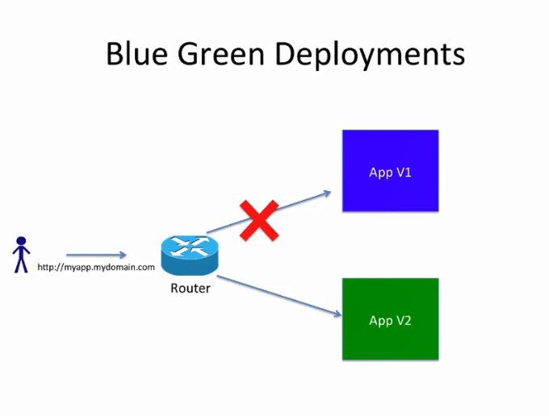

## This is a Openshift Blue - Green DEPLOYMENT demonstration with a simple PHP Application

create two aplications

- version blue and version green and change the route between the application by changing the service. so that we dont want to create two routes we can minimize te downtime
